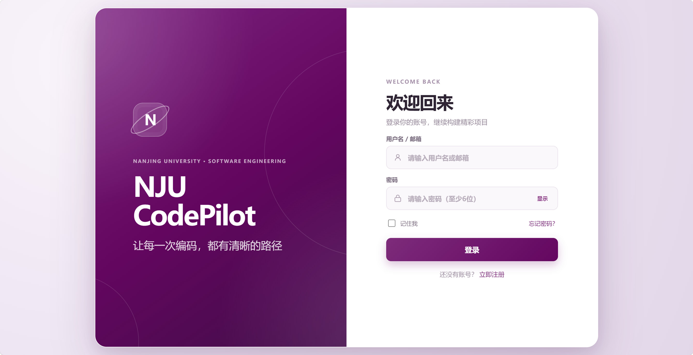
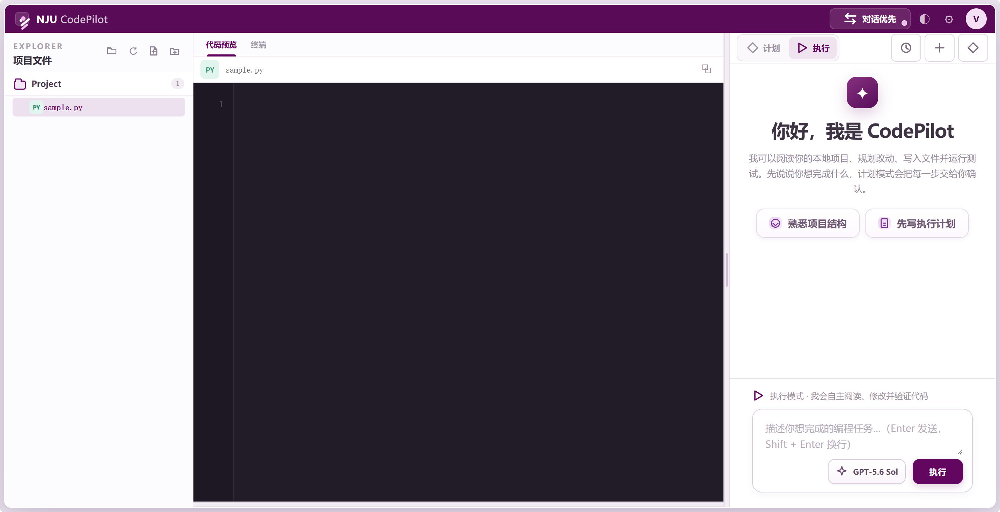
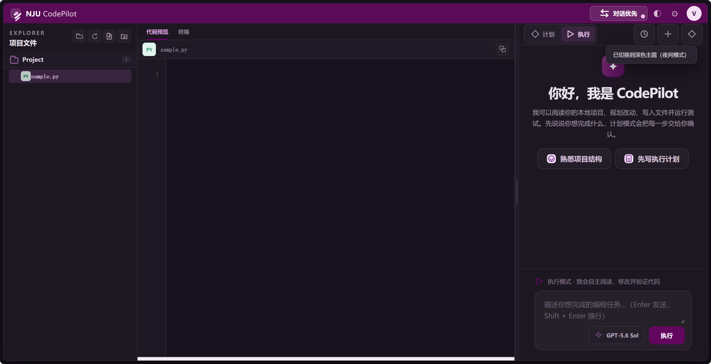
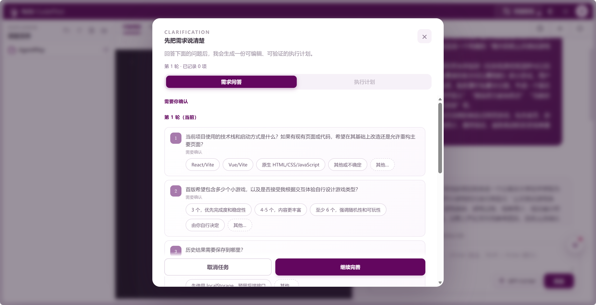
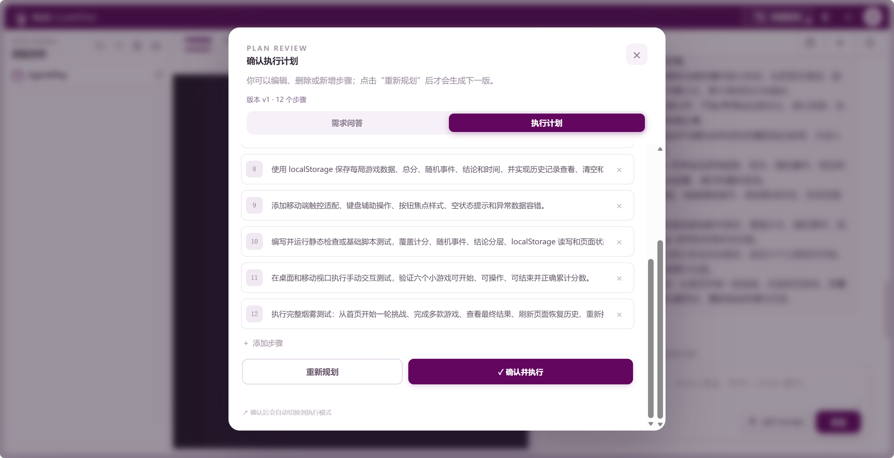
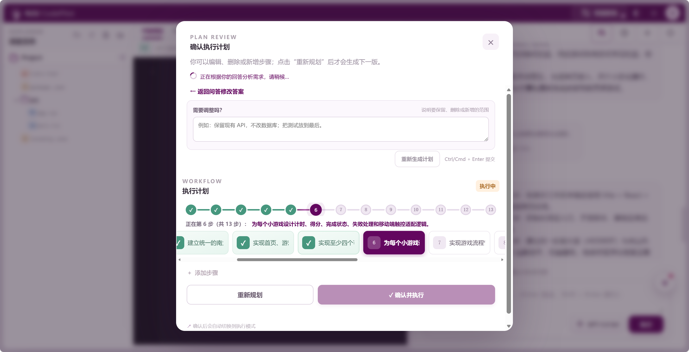
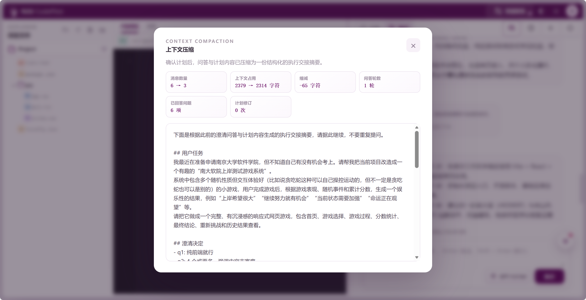

# NJU CodePilot：编程智能体

## 效果展示

### 登录页面



### 工作台（浅色主题）



### 工作台（深色主题）



### 需求QA可视化



### 计划调整可视化



### Agent执行可视化



### 上下文压缩



## 快速运行

### 1. 拉取项目

要求 Python 3.10+。在 PowerShell 或终端执行：

```powershell
git clone https://github.com/VinyYang/NJU-Agent.git
cd NJU-Agent
```

### 2. 启动 Agent

```powershell
python run.py
```

启动后会自动打开浏览器页面：

```text
http://127.0.0.1:8124/agent
```

如果要让 Agent 操作另一个已有项目目录，可先设置 workspace：

```powershell
$env:AGENT_WORKSPACE = "C:\\path\\to\\your\\project"
python run.py
```

也可以直接指定后端 workspace：

```powershell
python -m backend --host 127.0.0.1 --port 8124 --workspace "C:\\path\\to\\your\\project"
```

### 3. 配置模型（可选）

需要连接 OpenAI 兼容模型时，在本机 PowerShell 中设置环境变量：

```powershell
$env:OPENAI_API_KEY = "your-api-key"
$env:OPENAI_BASE_URL = "https://example.com/v1"
$env:CODING_AGENT_MODEL = "your-model"
$env:MODEL_WIRE_API = "auto"       # auto / responses / chat
$env:MODEL_REASONING_EFFORT = "medium"
python run.py
```

也可以复制 `.env.example` 为 `.env` 后填写。`.env` 已被 Git 忽略，请勿把真实 key 写入仓库、截图或视频。

## 使用 Agent

1. 在工作区中选择要操作的本地项目目录。
2. 在输入框描述编程任务，例如“为这个项目增加健康检查接口，并运行测试”。
3. Agent 会先判断任务类型。简单咨询会直接回答；明确的小改动可以直接执行；信息不足或需要审查的任务会进入计划流程。
4. 计划流程先进行多轮需求问答。补充目标文件、验收标准等信息后，Agent 生成可编辑的执行计划。
5. 在计划窗口中可以修改、删除或新增步骤，也可以提交反馈重新规划。确认当前计划后，Agent 才会开始执行。
6. 执行过程中，界面会实时展示模型回复、工具调用、文件改动、命令输出和计划进度。文件写入、补丁和删除都限制在 workspace 内；危险命令需要用户确认。
7. 计划确认与执行交接时会进行上下文压缩，将任务、澄清结论、安全假设和计划整理成 handoff checkpoint。点击“查看上下文压缩”可以查看压缩前后统计和摘要。
8. 文件发生变更后，Agent 必须运行测试或 smoke 命令并成功退出，才能报告完成；否则会停留在“需要验证”状态。

## 常用操作

- 左侧文件树：浏览和打开 workspace 内的文件。
- 编辑器：查看或编辑文件，保存后可在变更审核区域查看差异。
- 活动面板：查看 Agent 执行的命令和输出。
- 会话历史：恢复之前的任务、计划、事件和上下文压缩记录。
- 停止按钮：中止当前模型流或工具循环；中止不会绕过安全门禁。

## 手动验证

```powershell
python -m compileall -q backend run.py
python -m backend.smoke_plan_split
node --check frontend/app.js
node --test frontend/tests/ui-contract.test.mjs
```
